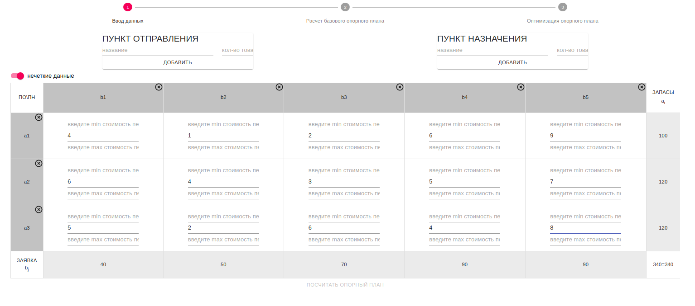

# Приложение для построения оптимального опорного плана 
 - подходит для четких и нечетких данных
 - рассчитывает оптимальный план перевозок
 - дает возможность получить отчет в формате pdf
 - использует метод stepping-stone для оптимизации 
 - ориентирован на нечеткие данные, оптимизация транспортных задач с которыми является более трудоемкой 

---

## Шаг 1 - Ввод данных

### Шаг 1.1 - ввод пунктов отправления, пунктов назначения + колличества доступной и требуемой продукции (товаров)
​
- добавление возможно по нажатию на кнопку "ДОБАВИТЬ"
- добавление возможно по нажатию на кнопку "ENTER" в любом поле (название/колличество)
- ввод в колличественные поля защищены валидацией на основе регулярных выражений
- добавление пункта без двух заполненных полей невозможно
- удаление пункта возможно в таблице, которая появляется сразу после добавления пункта
- ответсвенность за корректно введеные данные лежит на пользователе, суммарное колличество запасов в пунктах отправления должно соответствовать суммарному колличеству заявок от пунктов назначения (дополнительные пункты не строятся в автоматическом режиме) 

### Шаг 1.2 - ввод стоимости единицы товара между двумя пунктами (пункт отправления - пункт назначения)
​
- без заполненных полей стоимости каждой в ячейки не будет возможности посчитать опорный план, то есть перейти к следующему шагу
- ввод в колличественные поля защищены валидацией на основе регулярных выражений
- сохранение данных происходит в фоновом режиме
- данные доступны после перезагрузки страницы (используется localStorage)

### Шаг 1.2.1 - корректность введеных данных
​
- данные введены некорректно, о чем говорит неактивная кнопка "ПОСЧИТАТЬ ОПОРНЫЙ ПЛАН"
- данные введены некорректно, о чем говорит неактивный (горит серым, а не цветной цифрой) следующий шаг в верхней части приложения 
- данные введены некорректно, о чем говорит цветное цифренное обозначение текущего (первого) шага, а не цветная галочка 
- некорректность заключается в неполной заполненности стоимостей перевозок

---

​
- данные введены корректно, о чем говорит активная кнопка "ПОСЧИТАТЬ ОПОРНЫЙ ПЛАН"
- данные введены корректно, о чем говорит активный (горит цветной цифрой) следующий шаг в верхней части приложения 
- данные введены корректно, о чем говорит цветная галочка на  первом шаге (шаг ввода данных)
- корректность заключается в полной заполненности стоимостей перевозок

### Шаг 1.2.2 - ввод нечетких данных
​
- переключение на работу с нечеткими данными осуществляется с помощью переключателя, располагающегося под зоной добавления пунктов отправления и пунков назначения
- при переключении на работу с нечеткими данными поля ввода стоимости перевозки из пункта отправления в пункт назначения увеличивается до трех вводных полей, первое отвечает за минимальную стоимость, второе - за среднюю, третье - за максимальную
- при работе с нечеткими данными требуется заполнение каждого поля, а не частичное заполнение 
- возможность перехода к следующему шагу на данном этапе станет доступной после заполнения всех полей
- при ранее достпуном втором шаге, например, при заполнении таблицы четкими данными, и переключении на работу с нечеткими данными - возможный прогресс будет потерян, а пользователь возвращен на шаг, где требуются невведнные ранее данные, то есть снова активным станет первый шаг, а кнопка "ПОСТРОИТЬ ОПОРНЫЙ ПЛАН" станет недоступной

Корректное (и некорректное) введение нечетких данных дает результат аналогичный шагу 1.2.1
​

        ОСНОВНАЯ МЫСЛЬ
        На этапе шагов 1.1 и 1.2 в верхней части документа горит активным первый шаг, о чем говорит выделенная цветом цифра, после заполненения всех необходимых полей, икнока первого шага станет отображаться галочкой, подтверждая полноту необходимой информации, а не цифрой, что говорит о возмонжости перехода к следующему шагу

---

## Шаг 2 - Рассчет опорного плана

Когда введены все данные - становится активной кнопка "ПОСЧИТАТЬ ОПОРНЫЙ ПЛАН" и второй шаг в верхней части приложения становится текущем, то есть цвет меняется с серого на цветной (розовый), цифра сохраняется

Для того, чтобы рассчитать базовый опорный план необходимо надать кнопку "ПОСЧИТАТЬ ОПОРНЫЙ ПЛАН".

Как только план будет посчитан, под кнопкой "ПОСЧИТАТЬ ОПОРНЫЙ ПЛАН" появится нередактируемая таблица с базовым опорным планом

​

**снизу таблицы так же представлена рассчитанная стоимость общих затрат по данному опорному плану**

При условии работы с нечеткими данными, стоимость обших затрат будет представлена в виде нечеткого треугольного числа, снизу сразу же пишется автоматически рассчитаная величина отклонения, так же кнопке "ОПТИМИЗИРОВАТЬ ЗАТРАТЫ" написана текущая величина отклонения, которая будет меняться в ходе оптимизации

​

степпер в верхней части страницы меняет свой активный шаг, так как базовый опорный план рассчитан, второй шаг становится завершенным, его иконка меняется на галочки, активный шаг переходит в следующий этап - оптимизационный

Базовый опорный план рассчитывается методом серверно-западного угла.

## Шаг 3 Оптимизация решения

Оптимизация происходит stepping-stone методом, который предполагает циклический проход по каждой ячейки, а затем, после нахождения оптимального решения снова циклически по ячейкам, но уже по новой оптимизированной таблицы.

В приложении для оптимизации необходимо нажать кнопку "ОПТИМИЗИРОВАТЬ ЗАТРАТЫ", все расчеты происходят автоматически, то есть нажав на кнопку "ОПТИМИЗИРОВАТЬ ЗАТРАТЫ" происходит оптимизация не только базового опорного плана, который был получен методом северно-западного угла, но всех найденных оптимизированных решений, которых может быть достаточно много.

Оптимизация таким образом происходит до тех пор, пока она возможно, то есть пока величину отклонения возможно уменьшать.

​

Единственное отличие для четких и нечетких данных на данном шаге - это наличие графика, так как задача с нечеткими данными имеет вид нечеткого треугольника для общих затрат,  
для пользователя предоставляется данный график. Также этот график будет встроен в PDF-документ для нечетких данных.

​

## Шаг 4 Получение PDF-документа

После прохождения всех шагов  и оптимизации задачи для пользователя становятся доступными две кнопки, которые позволяют посмотреть и скачать PDF-документ, с отчетом о проделанной работе, в него входят:
- титульным листом с QR-кодом, который ведет на репозиторий с кодом приложения 
- исходные данные 
- опорный план, построенный методом северно-западного угла с общими затратами
- оптимизированное решение, полученное с помощью stepping-stone метода с общими затртатами
- граф нечеткого треугольного числа (только для нечетких данных)
- заметки с полезной информацией для пользователя

Все страницы пронумерованы.
Отчет может быть напечатан в нескольких форматах листа, которые автоматически подбираются в зависимости от наполненности таблицы, то есть, если таблица небольшая, то будет выбран формат А4 для печати, если же таблица слишком большая для данного формата, она будет увеличиваться до формата А3, чтобы данные в отчете не пострадали.

​

<!-- adding.png -->

<!-- ​ -->

# Getting Started with Create React App

This project was bootstrapped with [Create React App](https://github.com/facebook/create-react-app).

## Available Scripts

In the project directory, you can run:

### `npm start`

Runs the app in the development mode.\
Open [http://localhost:3000](http://localhost:3000) to view it in the browser.

The page will reload if you make edits.\
You will also see any lint errors in the console.

### `npm test`

Launches the test runner in the interactive watch mode.\
See the section about [running tests](https://facebook.github.io/create-react-app/docs/running-tests) for more information.

### `npm run build`

Builds the app for production to the `build` folder.\
It correctly bundles React in production mode and optimizes the build for the best performance.

The build is minified and the filenames include the hashes.\
Your app is ready to be deployed!

See the section about [deployment](https://facebook.github.io/create-react-app/docs/deployment) for more information.

### `npm run eject`

**Note: this is a one-way operation. Once you `eject`, you can’t go back!**

If you aren’t satisfied with the build tool and configuration choices, you can `eject` at any time. This command will remove the single build dependency from your project.

Instead, it will copy all the configuration files and the transitive dependencies (webpack, Babel, ESLint, etc) right into your project so you have full control over them. All of the commands except `eject` will still work, but they will point to the copied scripts so you can tweak them. At this point you’re on your own.

You don’t have to ever use `eject`. The curated feature set is suitable for small and middle deployments, and you shouldn’t feel obligated to use this feature. However we understand that this tool wouldn’t be useful if you couldn’t customize it when you are ready for it.

## Learn More

You can learn more in the [Create React App documentation](https://facebook.github.io/create-react-app/docs/getting-started).

To learn React, check out the [React documentation](https://reactjs.org/).

### Code Splitting

This section has moved here: [https://facebook.github.io/create-react-app/docs/code-splitting](https://facebook.github.io/create-react-app/docs/code-splitting)

### Analyzing the Bundle Size

This section has moved here: [https://facebook.github.io/create-react-app/docs/analyzing-the-bundle-size](https://facebook.github.io/create-react-app/docs/analyzing-the-bundle-size)

### Making a Progressive Web App

This section has moved here: [https://facebook.github.io/create-react-app/docs/making-a-progressive-web-app](https://facebook.github.io/create-react-app/docs/making-a-progressive-web-app)

### Advanced Configuration

This section has moved here: [https://facebook.github.io/create-react-app/docs/advanced-configuration](https://facebook.github.io/create-react-app/docs/advanced-configuration)

### Deployment

This section has moved here: [https://facebook.github.io/create-react-app/docs/deployment](https://facebook.github.io/create-react-app/docs/deployment)

### `npm run build` fails to minify

This section has moved here: [https://facebook.github.io/create-react-app/docs/troubleshooting#npm-run-build-fails-to-minify](https://facebook.github.io/create-react-app/docs/troubleshooting#npm-run-build-fails-to-minify)
